# ✨ GenAI Guardrails ✨

> A self-contained learning path for designing, implementing, evaluating, and operating guardrails for generative AI applications and agents.

[](curriculum/beginner/01-what-are-guardrails/README.md) [](LICENSE) [](CONTRIBUTING.md)

Guardrails are the policies, validators, controls, and recovery paths that keep a generative AI system within an intended operating envelope. They are not a single prompt, model, filter, or vendor feature. Effective systems combine deterministic application controls, specialized classifiers, model-based checks, permissions, human review, and continuous evaluation.

This repository explains the concepts from first principles, provides scenario recipes and provider-neutral companion files in the scenario-cookbook lesson, and links to maintained technologies and primary guidance. It covers both conversational LLM applications and tool-using agents.

## Contents

- [Start here](#start-here)
- [Guardrails visual model](#guardrails-visual-model)
- [Curriculum roadmap](#curriculum-roadmap)
- [Run locally](#run-locally)
- [Guardrail layers](#guardrail-layers)
- [Best-practice checklist](#best-practice-checklist)
- [Technology landscape](#technology-landscape)
- [Scenario cookbook](#scenario-cookbook)
- [Evaluation and red teaming](#evaluation-and-red-teaming)
- [Security and privacy](#security-and-privacy)
- [Interactive knowledge check](#interactive-knowledge-check)
- [Official and open-source resources](#official-and-open-source-resources)
- [Contributing](#contributing)

## Start here

1. Read [What are guardrails?](curriculum/beginner/01-what-are-guardrails/README.md) for the threat model and layered control model.
2. Learn the [guardrail lifecycle](curriculum/beginner/02-guardrail-lifecycle/README.md): define policy, map boundaries, observe, decide, recover, measure, and improve.
3. Work through [best practices](curriculum/intermediate/01-best-practices/README.md) before choosing a framework.
4. Pick a recipe in the [scenario cookbook](#scenario-cookbook) and adapt its policy, failure response, and tests.
5. Study [evaluation and red teaming](curriculum/advanced/01-evaluation-and-red-teaming/README.md) with a representative adversarial dataset.
6. Take the [interactive GenAI Guardrails Knowledge Check](https://mahsa-teimourikia.github.io/gen-ai-guardrails/).

## Guardrails visual model



<sub>Diagram source: [Mermaid](assets/guardrails-layers.mmd).</sub>

```text
request → input checks → retrieval/tool controls → model → output checks → response
                    ↘ policy decision, audit, metrics, escalation ↙
```

No layer is perfect. The design goal is defense in depth with clear ownership and safe failure behavior.

## Curriculum roadmap

The curriculum progresses from understanding the control model, to designing controls, to evaluating and operating them.

### Beginner — Understand the control model

| Course | Main question | Core capability |
| --- | --- | --- |
| [What are GenAI guardrails?](curriculum/beginner/01-what-are-guardrails/README.md) | What is the operating envelope? | Distinguish boundaries, control types, and safe failure behavior |
| [Guardrail lifecycle](curriculum/beginner/02-guardrail-lifecycle/README.md) | How does policy become a control? | Define, decide, execute, recover, measure, and improve |

### Intermediate — Design and implement controls

| Course | Main question | Core capability |
| --- | --- | --- |
| [Best practices](curriculum/intermediate/01-best-practices/README.md) | How should production controls be designed? | Apply risk, boundary, failure, evaluation, and operations practices |
| [Scenario cookbook](curriculum/intermediate/02-scenario-cookbook/README.md) | How do controls vary by use case? | Compose controls for concrete trust boundaries and consequences |

### Advanced — Evaluate, red-team and operate

| Course | Main question | Core capability |
| --- | --- | --- |
| [Evaluation and red teaming](curriculum/advanced/01-evaluation-and-red-teaming/README.md) | How do we know controls work under attack? | Measure, calibrate, red-team, and gate a guardrail with tests |
| [Security and privacy](curriculum/advanced/02-security-and-privacy/README.md) | How do we operate controls against threats? | Protect identities, data, tools, dependencies, and incident evidence with tests |

See the complete [curriculum map](curriculum/README.md).

### Primary guidance

- [NIST AI RMF Generative AI Profile](https://nvlpubs.nist.gov/nistpubs/ai/NIST.AI.600-1.pdf)
- [OWASP Top 10 for LLM Applications](https://genai.owasp.org/llm-top-10/)
- [OWASP Agentic AI Threats and Mitigations](https://genai.owasp.org/resource/agentic-ai-threats-and-mitigations/)
- [NVIDIA NeMo Guardrails](https://docs.nvidia.com/nemo/guardrails/)
- [Guardrails AI](https://guardrailsai.com/guardrails/docs)
- [Azure AI Content Safety and Prompt Shields](https://learn.microsoft.com/en-us/azure/ai-services/content-safety/overview)
- [OpenAI safety best practices](https://platform.openai.com/docs/guides/safety-best-practices)
- [NIST AI RMF Playbook](https://airc.nist.gov/airmf-resources/playbook/)

## Run locally

```bash
git clone https://github.com/mahsa-teimourikia/gen-ai-guardrails.git
cd gen-ai-guardrails
make setup-contributor
make test
make quiz-test
```

On Windows, create and activate a virtual environment manually with `py -3.11 -m venv .venv`, activate `.venv\Scripts\activate`, and install with `python -m pip install -e ".[contributor]"`. Run the Makefile commands from Git Bash or use the equivalent Python and npm commands in PowerShell.

| Useful check | Command |
| --- | --- |
| Python tests | `make test` |
| Internal links | `make links` |
| Execute notebooks | `make notebooks` |
| Quiz tests | `make quiz-test` |
| Python syntax | `python -m compileall -q curriculum tests` |

## Guardrail layers

| Layer | Question | Examples |
| --- | --- | --- |
| Input | Should this request enter the system? | Abuse, jailbreak, topic, PII, injection, authentication |
| Retrieval | Can this context be trusted and shown? | Access control, poisoning, relevance, PII, instruction stripping |
| Dialog/policy | Is the conversation within scope? | Topic routing, policy state, consent, escalation |
| Tool/execution | May this action run with these arguments? | Schema, authorization, allowlists, dry run, approval |
| Model | What behavior is expected? | System policy, structured outputs, constrained decoding |
| Output | Can this response be shown or acted on? | Safety, PII, secrets, groundedness, citations, schema |
| Operations | Can we detect and recover from failures? | Traces, audit, rate limits, kill switch, incident response |

The [NeMo Guardrails rail types](https://docs.nvidia.com/nemo/guardrails/about-nemo-guardrails-library/rail-types) provide a useful vocabulary: input, retrieval, dialog, execution, and output rails.

## Best-practice checklist

- [ ] Write policy as observable, testable rules with owners and exceptions.
- [ ] Classify risks by severity, likelihood, reversibility, and affected people.
- [ ] Put deterministic authorization and access control outside the model.
- [ ] Inspect both user input and untrusted retrieved/tool content for injection.
- [ ] Validate tool names, arguments, identity, target, and expected side effect before execution.
- [ ] Use least privilege, environment isolation, short-lived credentials, and human approval for consequential actions.
- [ ] Validate model output against schemas, business rules, provenance, and safety policies.
- [ ] Make block, transform, retry, abstain, and escalate responses explicit.
- [ ] Log policy decisions and trace IDs without retaining unnecessary sensitive content.
- [ ] Measure false positives, false negatives, latency, cost, coverage, and drift.
- [ ] Test adversarially before release and continuously after deployment.
- [ ] Provide a safe fallback and an operator kill switch.

## Technology landscape

### Programmable guardrail frameworks

- [NVIDIA NeMo Guardrails](https://github.com/NVIDIA/NeMo-Guardrails) — Python toolkit with YAML, Colang flows, input/retrieval/dialog/execution/output rails, custom actions, evaluation, and observability.
- [Guardrails AI](https://github.com/guardrails-ai/guardrails) — validators and input/output guards, with a hub of reusable validators.
- [Guidance](https://github.com/guidance-ai/guidance) — constrained generation and structured control.
- [Outlines](https://github.com/dottxt-ai/outlines) — structured generation and grammar-constrained outputs.
- [Instructor](https://github.com/567-labs/instructor) — schema-driven structured outputs with validation and retries.
- [Pydantic](https://github.com/pydantic/pydantic) — typed validation layer for Python data and model outputs.

### Safety and content classifiers

- [Llama Guard](https://github.com/meta-llama/PurpleLlama) — Meta's open safety classification models and tooling.
- [Azure AI Content Safety](https://learn.microsoft.com/en-us/azure/ai-services/content-safety/overview) — harmful-content detection for text and images.
- [Azure Prompt Shields](https://learn.microsoft.com/en-us/azure/ai-services/content-safety/concepts/jailbreak-detection) — detects user prompt attacks and document attacks.
- [Presidio](https://github.com/microsoft/presidio) — PII detection, anonymization, and de-identification.
- [Protect AI LLM Guard](https://github.com/protectai/llm-guard) — input/output scanners for prompt injection, sensitive data, toxicity, and more.
- [NVIDIA NeMo Guardrails catalog](https://docs.nvidia.com/nemo/guardrails/configure-guardrails/guardrail-catalog) — configurable safety, jailbreak, topic, PII, hallucination, and agentic-security rails.

### Policy, observability, and testing

- [OpenTelemetry](https://opentelemetry.io/) — vendor-neutral traces, metrics, and logs.
- [OpenInference](https://github.com/Arize-ai/openinference) — semantic conventions for LLM and agent traces.
- [Langfuse](https://github.com/langfuse/langfuse) — open-source tracing, prompts, evaluations, and datasets.
- [Arize Phoenix](https://github.com/Arize-ai/phoenix) — open-source tracing and evaluation.
- [promptfoo](https://github.com/promptfoo/promptfoo) — red teaming and evals for prompts, models, and guardrails.
- [Garak](https://github.com/NVIDIA/garak) — LLM vulnerability scanner and probe framework.
- [PyRIT](https://github.com/Azure/PyRIT) — Microsoft's open-source risk identification toolkit for generative AI.
- [Inspect AI](https://github.com/UKGovernmentBEIS/inspect_ai) — evaluation framework from the UK AI Security Institute.
- [DeepEval](https://github.com/confident-ai/deepeval) — test framework for LLM applications and safety criteria.

## Scenario cookbook

| Scenario | Starting controls |
| --- | --- |
| Customer-support assistant | Input abuse/topic checks, retrieval ACLs, policy routing, grounded output, human escalation |
| RAG over private documents | Tenant authorization before retrieval, document poisoning checks, citation and groundedness validation |
| Coding agent | Sandboxed execution, command allowlist, workspace scope, secret isolation, test gate, approval before publish |
| Tool-using business agent | Typed schemas, least privilege, target validation, dry-run preview, idempotency, approval |
| PII-sensitive assistant | Detect and minimize PII, purpose limitation, masking/tokenization, retention and deletion |
| Public creative application | Abuse and self-harm policy, rate limits, content classification, user reporting, appeal path |
| Regulated decision support | Human decision-maker, evidence trace, uncertainty, bias testing, no automatic adverse action |
| Multimodal application | Scan text, images, files, and OCR output; preserve provenance and modality-specific policy |

See [Scenario cookbook](curriculum/intermediate/02-scenario-cookbook/README.md) for implementation sequences and its provider-neutral companion files.

## Evaluation and red teaming

Evaluate four dimensions separately:

1. **Safety:** harmful content, jailbreaks, prompt injection, privacy, and policy violations.
2. **Reliability:** schema validity, groundedness, refusal quality, and recovery behavior.
3. **Security:** unauthorized access, tool misuse, data exfiltration, and privilege escalation.
4. **Operations:** latency, cost, false-positive friction, trace completeness, and drift.

Use executable checks when possible, model graders only with calibration, and human review for high-impact decisions. Read [Evaluation and red teaming](curriculum/advanced/01-evaluation-and-red-teaming/README.md).

## Security and privacy

Guardrails reduce risk; they do not make an application safe by themselves. Keep authorization, secrets, network boundaries, transaction controls, data retention, and incident response in the surrounding application and infrastructure.

Use [OWASP's LLM risks](https://genai.owasp.org/llm-top-10/), [OWASP agentic threats](https://genai.owasp.org/resource/agentic-ai-threats-and-mitigations/), [NIST AI RMF](https://www.nist.gov/itl/ai-risk-management-framework), and [MITRE ATLAS](https://atlas.mitre.org/) to structure threat modeling.

## Interactive knowledge check

Take the [GenAI Guardrails Knowledge Check](https://mahsa-teimourikia.github.io/gen-ai-guardrails/)—18 multiple-answer questions covering guardrail layers, policy design, injection, privacy, tools, evaluation, and operations. It grades exact answer sets, gives topic scores, reveals explanations on request, and stores progress only in the browser.

## Official and open-source resources

- [NIST AI RMF Generative AI Profile](https://nvlpubs.nist.gov/nistpubs/ai/NIST.AI.600-1.pdf)
- [NIST AI RMF Playbook](https://airc.nist.gov/airmf-resources/playbook/)
- [OWASP Top 10 for LLM Applications](https://genai.owasp.org/llm-top-10/)
- [OWASP Agentic AI Threats and Mitigations](https://genai.owasp.org/resource/agentic-ai-threats-and-mitigations/)
- [OpenAI safety best practices](https://platform.openai.com/docs/guides/safety-best-practices)
- [Anthropic trust and safety research](https://www.anthropic.com/research/trustworthy-agents)
- [NVIDIA NeMo Guardrails docs](https://docs.nvidia.com/nemo/guardrails/)
- [Guardrails AI docs](https://guardrailsai.com/guardrails/docs)
- [Microsoft Prompt Shields](https://learn.microsoft.com/en-us/azure/ai-services/content-safety/concepts/jailbreak-detection)
- [Microsoft Presidio](https://microsoft.github.io/presidio/)
- [Meta PurpleLlama](https://github.com/meta-llama/PurpleLlama)
- [Garak](https://docs.garak.ai/)
- [PyRIT](https://azure.github.io/PyRIT/)

## Contributing

Please read [CONTRIBUTING.md](CONTRIBUTING.md). Prefer primary sources, maintained open-source projects, concrete threat models, and examples that explain failure behavior as well as the happy path.

Community standards and help:

- [Code of Conduct](CODE_OF_CONDUCT.md)
- [Support and issue-routing guide](SUPPORT.md)
- [Security policy and private reporting](SECURITY.md)

## License

This repository is licensed under the [MIT License](LICENSE).
