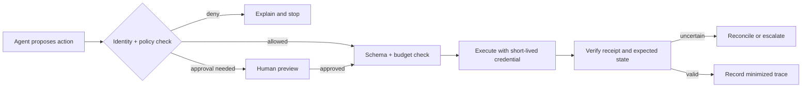

# Scenario cookbook

**Level:** Intermediate  
**Estimated time:** 45–60 minutes  
**Prerequisites:** [Best practices for production guardrails](../01-best-practices/README.md)  
**Notebook:** [scenario_cookbook.ipynb](scenario_cookbook.ipynb)  
**Scenario:** Internal HR/IT support assistant  
**Examples:** [`examples/`](examples/)

## Learning objectives

- Route typed expense claims through schema, invariant, and confidence checks in section 2.
- Preview, authorize, budget, execute, verify, and reconcile agent writes in section 3.
- Apply deterministic moderation prechecks and category outcomes, then compute FP/FN in section 4.
- Fill a scenario-specific release checklist from lab evidence in section 5.
- Extend the recipes with regression cases and explain their boundaries in section 6.

Use these compact patterns to translate the policy guidance into an implementation plan. Adapt the thresholds, owners, and failure behavior to your risk register; the snippets are deliberately provider-neutral.

## Customer-support assistant

Goal: answer from tenant-approved documents without leaking private data.

In the lab: this support recipe is covered by the [Course 01 lab](../../beginner/01-what-are-guardrails/README.md).

1. Authenticate the user and attach a tenant identifier.
2. Filter retrieval by tenant and document ACL before ranking.
3. Scan retrieved text for prompt injection and redact secrets or unnecessary PII.
4. Require citations for claims; abstain when evidence is missing.
5. Apply an output policy for sensitive topics, then log a minimized decision trace.

```python
context = retrieve(query, tenant_id=user.tenant_id, acl=user.document_acl)
context = retrieval_rail(context, tenant=user.tenant_id)
answer = model.generate(query=query, context=mark_untrusted(context))
return output_rail(answer, require_citations=True, pii_policy="minimize")
```

## Data extraction pipeline

Goal: turn documents into a typed record without silently accepting malformed or adversarial values.

In the lab: `ExpenseClaimV2` rejects unknown fields, checks invariants, preserves spans, and routes low-confidence claims.

- Keep the schema versioned and reject unknown fields where appropriate.
- Validate ranges, enum values, units, and cross-field invariants deterministically.
- Preserve source spans and confidence for every extracted field.
- Route low-confidence or high-impact records to a human review queue.

```python
candidate = extractor.parse(document, schema=InvoiceV3)
record = InvoiceV3.model_validate(candidate)
if not invariants_hold(record) or record.confidence < 0.9:
    return escalate(record, reason="needs-review")
return persist(record, source_spans=candidate.source_spans)
```

## Agent that writes to external systems

Goal: constrain a model that can create tickets, send messages, or change records.



Start with dry-run mode. Add an idempotency key, per-user spend and turn budgets, an allowlisted tool set, and an emergency kill switch before enabling writes.

In the lab: `ProposedAction`, `approve_gate`, and `Executor` implement this sequence with receipts, budgets, and reconciliation.

## Content moderation gateway

Run a fast deterministic check first (size, MIME type, tenant, rate limit), then a content classifier or provider safety API. Treat the result as a policy signal: block, transform, allow with warning, or escalate. Version the classifier and threshold, and measure false positives and false negatives by category.

In the lab: frozen scores (not a live classifier) feed versioned thresholds after the prechecks.

| Outcome | Meaning |
| --- | --- |
| Allow | No category crosses a configured warning threshold |
| Transform | A category reaches the warning threshold; allow with a warning |
| Escalate | A category reaches the escalation threshold and needs review |
| Block | A category reaches the blocking threshold |

## Release checklist

- [ ] Scenario has an owner, harm model, and documented fail-open/fail-closed choice.
- [ ] Trust boundaries and untrusted inputs are explicit.
- [ ] Authorization is enforced outside the model.
- [ ] High-impact actions have preview, approval, idempotency, and reconciliation.
- [ ] Shadow and alert modes have a baseline before enforcement.
- [ ] Synthetic adversarial cases and regression tests are in CI.
- [ ] Logs are useful but minimized, access-controlled, and retention-limited.

See the [best-practices guide](../01-best-practices/README.md), [security and privacy guide](../../advanced/02-security-and-privacy/README.md), and [evaluation guide](../../advanced/01-evaluation-and-red-teaming/README.md) for the rationale and references.

The `examples/guardrail_pipeline.py` file remains an ordering sketch: its detector helpers are stubs with constant results, while the implemented recipes live in `cookbook_lab.py`. The `examples/nemo-config.yml` file is illustrative vendor configuration, not a required runtime dependency.

## Exercises

1. Add an extraction candidate with no line items and predict the invariant route.
2. Turn on the agent policy kill switch and explain which writes stop while reads remain available.
3. Add a moderation category or threshold and update its per-category FP/FN regression test.

## Setup

Run the lab using the root README's [Run locally](../../../README.md#run-locally) instructions.

## Where this fits

Continue with [Evaluation and red teaming](../../advanced/01-evaluation-and-red-teaming/README.md) to turn these scenario cases into adversarial regression suites.
