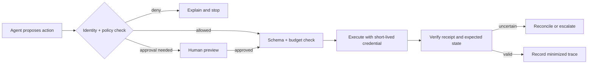

# Scenario cookbook

Use these compact patterns to translate the policy guidance into an implementation plan. Adapt the thresholds, owners, and failure behavior to your risk register; the snippets are deliberately provider-neutral.

## Customer-support assistant

Goal: answer from tenant-approved documents without leaking private data.

1. Authenticate the user and attach a tenant identifier.
2. Filter retrieval by tenant and document ACL before ranking.
3. Scan retrieved text for prompt injection and redact secrets or unnecessary PII.
4. Require citations for claims; abstain when evidence is missing.
5. Apply an output policy for sensitive topics, then log a minimized decision trace.

```python
context = retrieve(query, tenant_id=user.tenant_id, acl=user.document_acl)
context = retrieval_rail(context, tenant=user.tenant_id)
answer = model.generate(query=query, context=mark_untrusted(context))
return output_rail(answer, require_citations=True, pii_policy="minimize")
```

## Data extraction pipeline

Goal: turn documents into a typed record without silently accepting malformed or adversarial values.

- Keep the schema versioned and reject unknown fields where appropriate.
- Validate ranges, enum values, units, and cross-field invariants deterministically.
- Preserve source spans and confidence for every extracted field.
- Route low-confidence or high-impact records to a human review queue.

```python
candidate = extractor.parse(document, schema=InvoiceV3)
record = InvoiceV3.model_validate(candidate)
if not invariants_hold(record) or record.confidence < 0.9:
    return escalate(record, reason="needs-review")
return persist(record, source_spans=candidate.source_spans)
```

## Agent that writes to external systems

Goal: constrain a model that can create tickets, send messages, or change records.



Start with dry-run mode. Add an idempotency key, per-user spend and turn budgets, an allowlisted tool set, and an emergency kill switch before enabling writes.

## Content moderation gateway

Run a fast deterministic check first (size, MIME type, tenant, rate limit), then a content classifier or provider safety API. Treat the result as a policy signal: block, transform, allow with warning, or escalate. Version the classifier and threshold, and measure false positives and false negatives by category.

## Release checklist

- [ ] Scenario has an owner, harm model, and documented fail-open/fail-closed choice.
- [ ] Trust boundaries and untrusted inputs are explicit.
- [ ] Authorization is enforced outside the model.
- [ ] High-impact actions have preview, approval, idempotency, and reconciliation.
- [ ] Shadow and alert modes have a baseline before enforcement.
- [ ] Synthetic adversarial cases and regression tests are in CI.
- [ ] Logs are useful but minimized, access-controlled, and retention-limited.

See the [best-practices guide](best-practices.md), [security and privacy guide](security-and-privacy.md), and [evaluation guide](evaluation-and-red-teaming.md) for the rationale and references.
